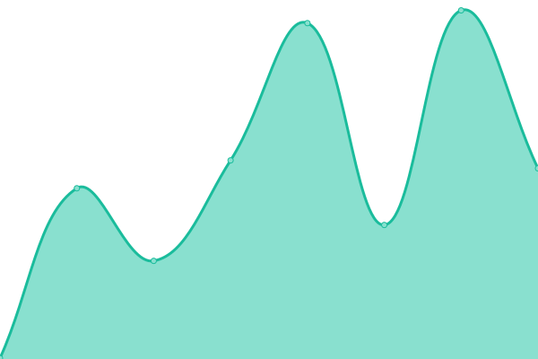
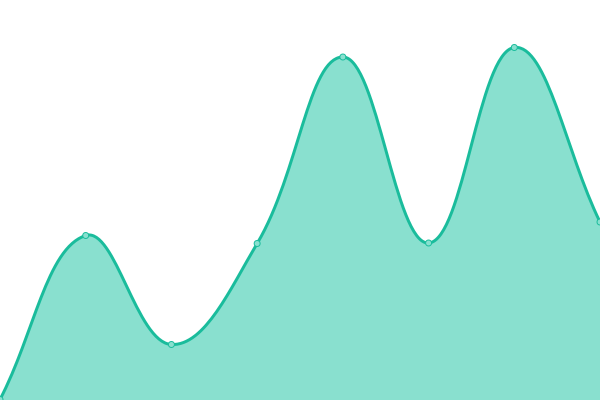
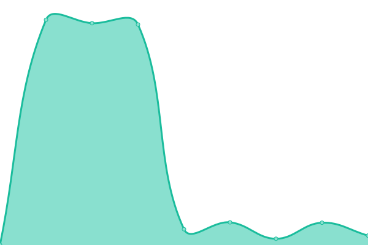

# [📈 Live Status](https://webstatus.thecyberss.com/): <!--live status--> **🟩 All systems operational**

This repository contains the open-source uptime monitor and status page for [olmloa](https://webstatus.thecyberss.com/), powered by [Upptime](https://github.com/upptime/upptime).

With [Upptime](https://upptime.js.org), you can get your own unlimited and free uptime monitor and status page, powered entirely by a GitHub repository. We use [Issues](https://github.com/olmloa/upptime/issues) as incident reports, [Actions](https://github.com/olmloa/upptime/actions) as uptime monitors, and [Pages](https://webstatus.thecyberss.com/) for the status page.

<!--start: status pages-->
<!-- This summary is generated by Upptime (https://github.com/upptime/upptime) -->
<!-- Do not edit this manually, your changes will be overwritten -->
<!-- prettier-ignore -->
| URL | Status | History | Response Time | Uptime |
| --- | ------ | ------- | ------------- | ------ |
|  [API FEL](18.234.19.5) | 🟩 Up | [api-fel.yml](https://github.com/olmloa/upptime/commits/HEAD/history/api-fel.yml) | 

 20ms
     
 | 

<a href="https://webstatus.thecyberss.com/history/api-fel">85.66%</a>
    

|  [Cyber Services Supply](https://cyberservicess.com/) | 🟩 Up | [cyber-services-supply.yml](https://github.com/olmloa/upptime/commits/HEAD/history/cyber-services-supply.yml) | 

 300ms
     
 | 

<a href="https://webstatus.thecyberss.com/history/cyber-services-supply">100.00%</a>
    

|  [Donas Clothes](https://donasclothes.com) | 🟩 Up | [donas-clothes.yml](https://github.com/olmloa/upptime/commits/HEAD/history/donas-clothes.yml) | 

 2477ms
     
 | 

<a href="https://webstatus.thecyberss.com/history/donas-clothes">97.67%</a>
    

|  [Kpitale](https://kpitale.com) | 🟩 Up | [kpitale.yml](https://github.com/olmloa/upptime/commits/HEAD/history/kpitale.yml) | 

 773ms
     
 | 

<a href="https://webstatus.thecyberss.com/history/kpitale">100.00%</a>
    

|  [Distribuidora Vit](https://distribuidoravit.com) | 🟩 Up | [distribuidora-vit.yml](https://github.com/olmloa/upptime/commits/HEAD/history/distribuidora-vit.yml) | 

 3876ms
     
 | 

<a href="https://webstatus.thecyberss.com/history/distribuidora-vit">96.08%</a>
    

|  [Framart Group](https://framartgroup.com) | 🟩 Up | [framart-group.yml](https://github.com/olmloa/upptime/commits/HEAD/history/framart-group.yml) | 

 730ms
     
 | 

<a href="https://webstatus.thecyberss.com/history/framart-group">99.84%</a>
    

|  [MediaNet](https://medianet-pa.com) | 🟩 Up | [media-net.yml](https://github.com/olmloa/upptime/commits/HEAD/history/media-net.yml) | 

 3909ms
     
 | 

<a href="https://webstatus.thecyberss.com/history/media-net">95.87%</a>
    

|  [TecniDental](https://tecnidentalpa.com) | 🟩 Up | [tecni-dental.yml](https://github.com/olmloa/upptime/commits/HEAD/history/tecni-dental.yml) | 

 7617ms
     
 | 

<a href="https://webstatus.thecyberss.com/history/tecni-dental">95.85%</a>
    

<!--end: status pages-->

[**Visit our status website →**](https://webstatus.thecyberss.com/)

## 📄 License

- Powered by: [Upptime](https://github.com/upptime/upptime)
- Code: [MIT](./LICENSE) © [olmloa](https://webstatus.thecyberss.com/)
- Data in the `./history` directory: [Open Database License](https://opendatacommons.org/licenses/odbl/1-0/)
